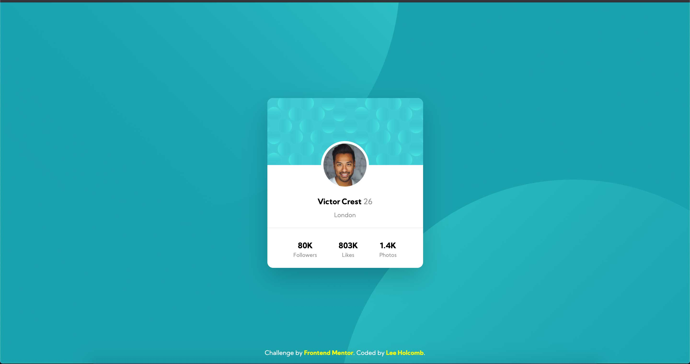

# Frontend Mentor - Profile card component solution

This is a solution to the [Profile card component challenge on Frontend Mentor](https://www.frontendmentor.io/challenges/profile-card-component-cfArpWshJ). Frontend Mentor challenges help you improve your coding skills by building realistic projects. 

## Table of contents

- [Overview](#overview)
  - [The challenge](#the-challenge)
  - [Screenshot](#screenshot)
  - [Links](#links)
- [My process](#my-process)
  - [Built with](#built-with)
  - [Continued development](#continued-development)
- [Author](#author)

## Overview

### The challenge

- Build out the project to the designs provided

### Screenshot

### Links
- Live Site URL: [Preview](https://lholcomb.github.io/Social-Media-Card/)

## My process

### Built with

- Semantic HTML5 markup
- CSS custom properties
- Flexbox
- Mobile-first workflow

### Continued development

Continue to get a better grasp of flexbox and positioning with CSS.

## Author

- LinkTree - [Lee Holcomb](https://linktr.ee/lholcomb)
- Frontend Mentor - [@lholcomb](https://www.frontendmentor.io/profile/lholcomb)
- Twitter - [@lee_holcomb](https://www.twitter.com/lee_holcomb)
